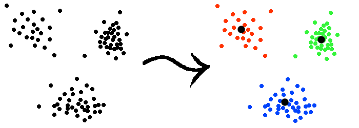
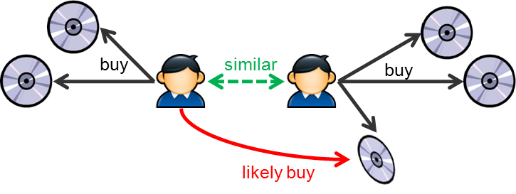
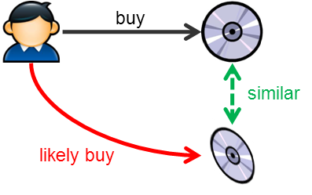
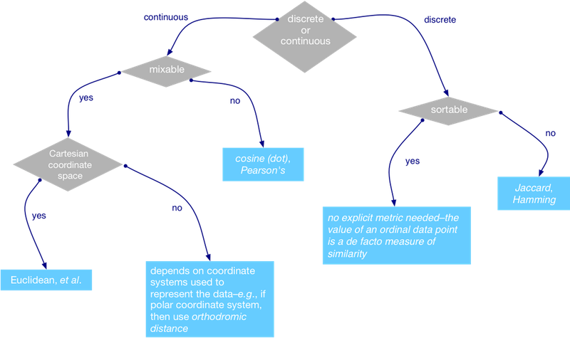
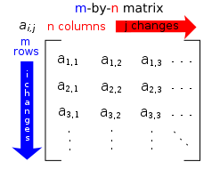
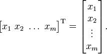

# Machine Learning with Ruby

	
    
    Machine Learning with
      _____       _           
     |  __ \     | |          
     | |__) |   _| |__  _   _ 
     |  _  / | | | '_ \| | | |
     | | \ \ |_| | |_) | |_| |
     |_|  \_\__,_|_.__/ \__, |
                         __/ |
                        |___/     Programming Language
                                      
    

Saleem Ansari (`@tuxdna`)

[http://tuxdna.in/](http://tuxdna.in/)

---

# Outline
## What is Machine Learning?
## Some Math
## Demo

---

# What is Machine Learning?

 * **1959** - Field of study that gives computers the ability to learn without being explicitly programmed.

 * **1998** - A computer program is said to learn from experience **E** with respect to some task **T** and some performance **P**, if its performance on **T**, as measured by **P**, improves with experience **E**.

---

# What can we achive?

* *Product Recommendation*: understanding / inferring what your customers are looking for
* *Clustering*: grouping similar items or grouping very similar documents, which are perhaps talking about the same subject
* *Regression and Classification*: predicting house prices, or identifying a class of an item viz. product, document, person etc.
* *Topic Modeling*: identifying topics from documents
* *Frequent Patterns Mining*: knowing which entities occur together very often
* And many more

---
# Classification

---
# Clustering

---
# Recommendation Algorithms

---

# Basic Ideas

 * Similarity and Distance metrics
 * Vector and Matrices
 * Statistics
 * Probability

---

# Similarity / Distance metrics

Different Similarity metrics

 * Pearson correlation
 * Euclidean distance
 * Cosine measure
 * Spearman correlation
 * Tanimoto coefficient
 * Log likelihood test

Distance to Similarity conversion ( not the only way )

    s = 1 / ( 1 + d )

---

# Similarity / Distance metrics contd...

---

# Matrix

---

# Vector

---
# Statistics

What are the stats almost everyone knows?

 * mean / average / expectation
 * median
 * mode

What about these?

 * variance
 * stardard deviation

---
# Probability

 * Conditional Probability: `P(A|B) = num(A intersection B) / num(B)`
 * Bayes Rule: `P(A|B) = P(B|A) / P(B)`
 * Probability Distribution: PMF for discreet, PDF for continuous variables

---

# Matrix and Vector in Ruby

 * Vector
 * Matrix

( see the ruby docs )

 * What about a SparseMatrix ?

---

# Demo

* Generating Recommendations on MovieLens data
* Statistical News Classifier
* Clustering the Reuters news data
* Naive Bayes Classifier

---
# What's next?

Challenges to be solved within Ruby ecosystem:

  * Fast Math
  * Easy Plotting
  * Integrated Environment for ML
  
Is there any hope ?

 * AI4R
 * SciRuby
 * NMatrix
 * JRuby and Apache Mahout

---
# Questions

---

# References

 * [Machine Learning Intro](http://bit.ly/bryanl-machine-learning-intro-talk-code)
 * [ML Intro Code](https://github.com/bryanl/bryanl-wickedruby2013)
 * [News Aggregator App](https://github.com/siyelo/newsagg)
 * [Intro to ML in Ruby](http://blog.siyelo.com/intro-to-machine-learning-in-ruby/)
 * [Thinking about ML in Ruby](http://www.confreaks.com/videos/2887-rubyconf2013-thinking-about-machine-learning-with-ruby)
 * [ML is way easier that it looks](http://insideintercom.io/machine-learning-way-easier-than-it-looks/)
 * [Text Classification using SVM](http://neovintage.blogspot.in/2011/11/text-classification-using-support.html)
 * [ML with Ruby](http://slides.com/arnab_deka/ml-with-ruby)
 * [SVM in Ruby](https://www.igvita.com/2008/01/07/support-vector-machines-svm-in-ruby/)
 * [Weka ML Toolkit](http://www.cs.waikato.ac.nz/ml/weka/)
 * [Weka Explorer](https://weka.waikato.ac.nz/explorer)
 * [Data Mining with Weka](http://www.cs.waikato.ac.nz/ml/weka/mooc/dataminingwithweka/)

---

# References contd...

 * [SVM](http://en.wikipedia.org/wiki/Support_vector_machine)
 * [Selecting an appropriate similarity metric & assessing the validity of a k-means clustering model](https://stackoverflow.com/questions/8102515/selecting-an-appropriate-similarity-metric-assessing-the-validity-of-a-k-means)
 * [Converting Similarity to Distance and vice-versa](http://stackoverflow.com/questions/4064630/how-do-i-convert-between-a-measure-of-similarity-and-a-measure-of-difference-di)
 * [Mahout Scala and Spark bindings](http://mahout.apache.org/users/sparkbindings/home.html)
 * [Multivariate Normal Distribution](http://en.wikipedia.org/wiki/Multivariate_normal_distribution)
 * [Recommendation Engine](http://horicky.blogspot.in/2011/09/recommendation-engine.html)
 * [Logistic Regression](http://www.holehouse.org/mlclass/06_Logistic_Regression.html)
 * [Practical Machine Learning](http://www.mapr.com/practical-machine-learning)

---

# Thanks and happy coding :-)

